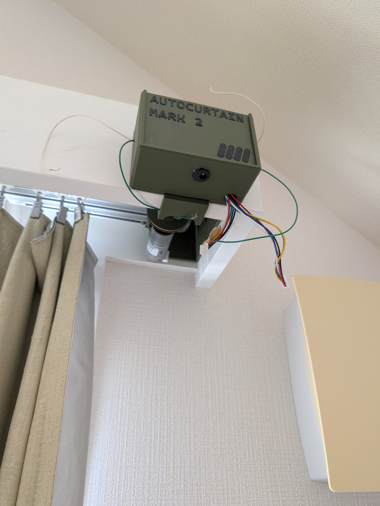
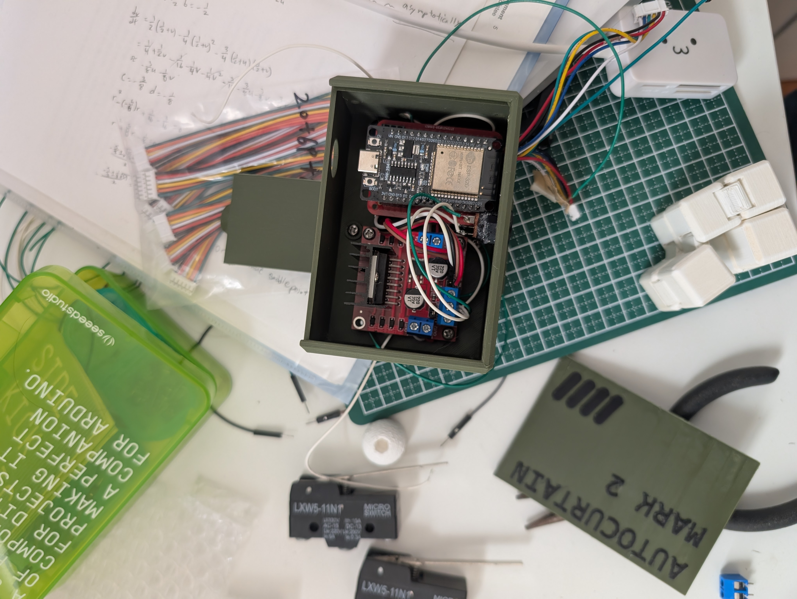
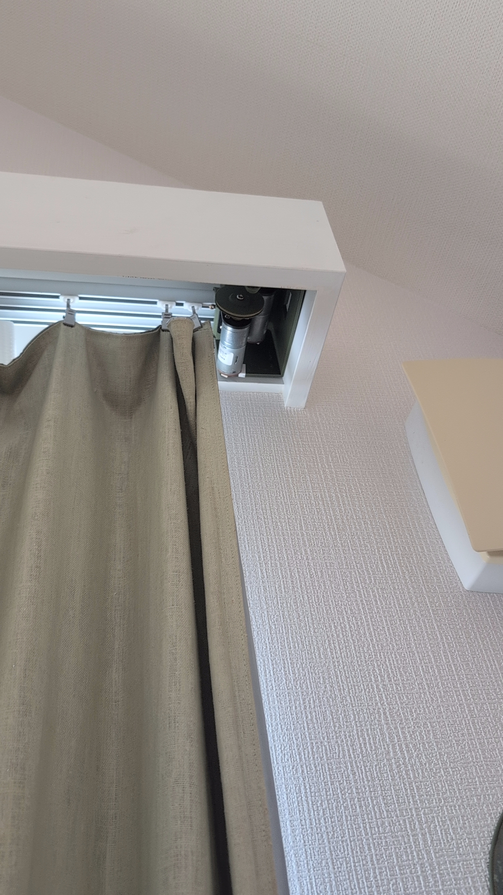

# AutoCurtain Mark 2

ESP32-powered automatic curtain controller. Controls two independent motorized curtains via an L298N motor driver using quadrature encoder feedback — no physical limit switches required. Fully local: the ESP32 hosts its own touch-friendly web UI + JSON API on your LAN, keeps time via NTP, and runs quiet two-stage morning/night routines.

<p align="center">
  
</p>

## Features

- **Dual independent motors** — open and close each curtain separately
- **Self-tuning stall detection** — each move learns its own healthy encoder rate, so end-of-travel is detected reliably regardless of belt tension; no limit switches
- **Absolute position tracking** — full travels calibrate the encoder span (persisted to flash), enabling "go to 50%" style commands from the web UI
- **Local web control** — minimal touch-first web page served from the ESP32; no cloud, no accounts
- **Scheduled routines** — two-stage open/close: half way 5 minutes before the set time, fully open/closed at the set time (NTP, Japan Standard Time)
- **Physical button control** — debounced buttons; press stops a moving curtain, otherwise alternates direction
- **PWM ramp control** — smooth motor acceleration to reduce curtain jerk
- **LED status indicators** — per-motor movement feedback + WiFi connection status

## Hardware

<p align="center">
  
</p>

### Components

| Component | Details |
|-----------|---------|
| Microcontroller | ESP32 DoiT DevKit V1 |
| Motor driver | L298N dual H-bridge |
| Motors | 2× DC motors with quadrature encoders |
| Enclosure | Custom 3D-printed |
| Inputs | 2× momentary push buttons |
| Indicators | 2× motor status LEDs, 1× WiFi connection LED |

### Pin Map

| Signal | GPIO |
|--------|------|
| Motor 1 (right curtain) IN1 / IN2 / EN | 16, 17, 5 |
| Motor 2 (left curtain) IN1 / IN2 / EN | 18, 19, 4 |
| Encoder 1 A / B | 32, 33 |
| Encoder 2 A / B | 25, 26 |
| Button 1 / Button 2 | 21, 22 |
| LED 1 / LED 2 | 23, 27 |
| WiFi LED | 2 |

## Getting Started

### Prerequisites

- [Arduino IDE 2.x](https://www.arduino.cc/en/software) or Arduino CLI
- ESP32 board support (3.x) — install via Boards Manager: **esp32 by Espressif**
- Library (install via Library Manager): `ArduinoJson` (v7)

### Setup

**1. Clone the repository**
```bash
git clone https://github.com/yourusername/curtainbotMARK2.git
cd curtainbotMARK2
```

**2. Create your secrets file**
```bash
cp firmware/curtainbot2_nov19a/arduino_secrets.h.template \
   firmware/curtainbot2_nov19a/arduino_secrets.h
```
Edit `arduino_secrets.h` and fill in your WiFi SSID and password.

**3. Check the config**
All tuning lives in `firmware/curtainbot2_nov19a/config.h`: timezone (defaults to JST), motor speed/direction, stall detection, routine staging, schedule defaults.

**4. Open the sketch**
Open `firmware/curtainbot2_nov19a/curtainbot2_nov19a.ino` in Arduino IDE and select Tools → Board → ESP32 Arduino → **DOIT ESP32 DEVKIT V1**.

**5. Upload**
Connect the ESP32 via USB and click Upload. Open the Serial Monitor at **115200 baud** — the device prints its IP address once WiFi connects.

**6. Calibrate**
Run one full **Close**, then one full **Open** on each curtain (buttons or web UI). This teaches the firmware each curtain's travel span and direction; position tracking and go-to then work, and the calibration persists across reboots.

## Web Control

Browse to `http://<device-ip>/` for the control page: per-curtain Open / Stop / Close, a go-to-position slider, and morning/night schedule settings.

### HTTP API

`POST /command` with JSON `{"cmd": "<name>", ...}`; `GET /status` returns live state as JSON.

| Command | Args | Action |
|---------|------|--------|
| `open_left` / `close_left` / `stop_left` | — | Drive/stop the left curtain (same for `_right`, `_both`) |
| `goto_left` / `goto_right` / `goto_both` | `pos` 0–100 | Move to an absolute position (needs calibration) |
| `set_morning` / `set_night` | `hour`, `min`, `enabled` | Configure the schedules |
| `recalibrate` | — | Forget span/position; next full close + open re-learns |

## Motor State Machine

```
STOPPED ──open cmd──▶ MOVING_OPEN  ──stall at limit──▶ OPEN
STOPPED ──close cmd─▶ MOVING_CLOSED──stall at limit──▶ CLOSED
moveToPercent(pct) ──▶ MOVING_* ──target reached──▶ STOPPED
```

Stall detection samples the encoder every `STALL_CHECK_MS`. Each move ratchets up its own cruise rate (highest delta seen — it only rises, so a slipping belt can't drag it down); dropping below `STALL_RATIO` of that rate (never below the `STALL_MIN_TICKS` floor) marks the mechanical limit and locks the state to `OPEN`/`CLOSED`. Endpoint stalls also re-anchor position tracking, and full travels re-measure the span, so calibration self-corrects over time.

## Installation

<p align="center">
  
</p>

The motor mounts inside the curtain valance and drives the existing curtain track directly. The 3D-printed enclosure houses the ESP32 and L298N and mounts at the end of the track.

## Project Structure

```
curtainbotMARK2/
├── firmware/
│   └── curtainbot2_nov19a/        # The sketch
│       ├── curtainbot2_nov19a.ino # Thin orchestrator (setup/loop)
│       ├── config.h               # Every tunable in one place
│       ├── control.h              # Motor class, encoder ISRs, button logic
│       ├── calibration.h          # Travel span/position persistence (NVS)
│       ├── scheduler.h            # NTP + two-stage morning/night routines
│       ├── commands.h             # Command registry (one row per action)
│       ├── webui.h                # Embedded web page + HTTP API
│       └── arduino_secrets.h.template
└── docs/
    └── images/
```

## Build via Arduino CLI

```bash
arduino-cli compile \
  --fqbn esp32:esp32:esp32doit-devkit-v1 \
  firmware/curtainbot2_nov19a

arduino-cli upload \
  -p <PORT> \
  --fqbn esp32:esp32:esp32doit-devkit-v1 \
  firmware/curtainbot2_nov19a
```
